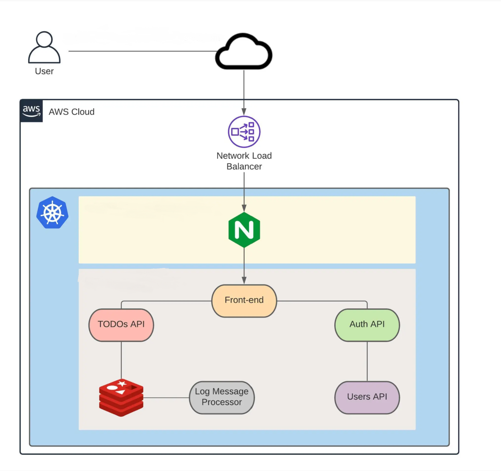

# KubeToDo
A To-do application deployed on Elastic Kubernetes Service (EKS).  

The architecture of this application is designed to mimic a real world web application development, such that each microservice is deployed in a container as a pod within a Kubernetes Cluster and each microservice is written a different framework.
The microservice distribution is as follows:

* Frontend: [VueJs](https://vuejs.org/)
* Todos API: [NodeJs](https://nodejs.org/)
* Auth API: [GoLang](https://golang.org/)
* Database: [Redis](https://redis.io/) 
* Queue: [Python3](https://www.python.org/)
* Users API: [SrpingBoot](https://spring.io/)
* Network Operator: [Calico](https://www.projectcalico.org/)
* Ingress Controller: [Kubernetes-NGINX](https://www.nginx.com/)

## Flowchart:

 

